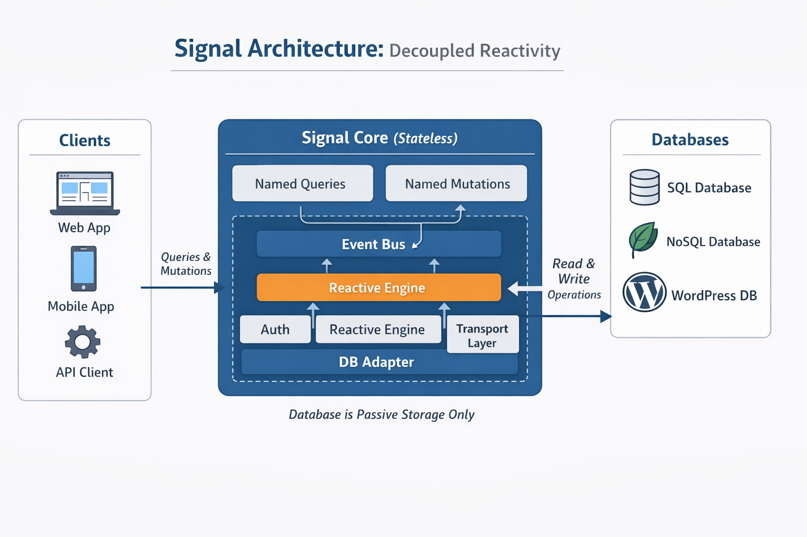

# Signal - Production-Grade Backend Framework

A Meteor-like backend framework redesigned for stateless, serverless, database-agnostic environments.

## 🎯 Philosophy

Signal brings the best of Meteor (named queries/mutations, automatic data management, events) to modern serverless architectures. No long-lived connections, no implicit subscriptions, no magic—just explicit, deterministic backend code.

## 🏗️ Architecture



## 📦 Key Features

### ✅ Non-Negotiable Design Constraints

- **Framework-level, backend-only** - Not a full-stack framework
- **Named queries only** - No implicit queries, all explicit
- **Named mutations only** - Mutations are the exclusive write path
- **Stateless events** - At-least-once, unordered, deterministic
- **No server-side observers** - No change streams, no DB triggers
- **Deterministic handlers** - Same input = same output
- **Serverless-ready** - Runs on Vercel, Fly, VPS, Edge

### 🏗️ Production Guarantees

1. **Runtime Immutability** - Configuration frozen after startup
2. **Explicit Lifecycle** - `configure()` → `register()` → `start()`
3. **Registry Integrity** - Unique names, no overrides
4. **Context Safety** - Immutable, request-scoped, serializable
5. **Access Control** - Declarative, enforced before execution
6. **Error Model** - Deterministic codes, safe serialization
7. **Input Validation** - Lightweight, fail-fast
8. **Event Discipline** - Stateless, stable naming, at-least-once

## 🚀 Quick Start

```typescript
import { Signal, MemoryAdapter, InMemoryTransport } from "signal";

// 1. Create and configure
const signal = new Signal();
signal.configure({
  db: new MemoryAdapter(),
  transport: new InMemoryTransport(),
});

// 2. Register collection with access control
signal
  .collection("posts")
  .access({
    query: { public: "public" },
    mutation: { create: "auth" },
  })
  .query("public", async (params, ctx) => {
    return await ctx.db.find("posts", { published: true });
  })
  .mutation("create", async (params, ctx) => {
    const postId = await ctx.db.insert("posts", {
      title: params.title,
      authorId: ctx.auth.user?.id,
    });
    await ctx.emit("posts.created", { postId });
    return { postId };
  });

// 3. Start
await signal.start();

// 4. Execute queries/mutations
const posts = await signal.query("posts.public", {}, context);
const result = await signal.mutation("posts.create", {
  title: "Hello",
}, context);
```

## 📚 Architecture

### Packages

```
/packages
  /core          # Signal.ts, Registry, Collection, Lifecycle, Context
  /db            # Database abstraction + adapters
  /transport     # Event bus + transport adapters
  /http          # HTTP handler, router, validation
  /security      # Auth, access control
  /utils         # Utilities (freeze, hash, logger)
```

### Core Concepts

#### Signal Instance
The main entry point, manages lifecycle and registry.

```typescript
const signal = new Signal();
signal.configure({ db, transport, logger });
signal.collection("posts").query(...).mutation(...);
await signal.start();
```

#### Collections
Groups queries and mutations under a single namespace with shared access control.

```typescript
signal.collection("posts").access({
  query: { public: "public", mine: (ctx) => ctx.auth.user != null },
  mutation: { create: "auth" },
});
```

#### Queries
Read-only operations with optional access control.

```typescript
.query("public", async (params, ctx) => {
  // params: { limit?: number, offset?: number, ... }
  // ctx: immutable context with db, auth, emit
  return await ctx.db.find("posts", { published: true });
})
```

#### Mutations
Write operations, the exclusive write path.

```typescript
.mutation("create", async (params, ctx) => {
  const id = await ctx.db.insert("posts", { ...params });
  await ctx.emit("posts.created", { id, ...params });
  return { id };
})
```

#### Context
Request-scoped, immutable, serializable.

```typescript
interface SignalContext {
  db: SignalDB;           // Database adapter
  auth: SignalAuth;       // Authentication/authorization
  emit: (name, payload) => Promise<void>;
  request?: HTTPRequest;  // Original request
  env?: Record<string, any>;
}
```

#### Access Control
Declarative rules enforced before execution.

```typescript
access: {
  query: {
    public: "public",                // Anyone
    mine: (ctx) => ctx.auth.user != null,  // Custom function
  },
  mutation: {
    create: "auth",                  // Authenticated users
    delete: "admin",                 // Admin users (custom rule)
  },
}
```

#### Events
Emitted only from mutations, at-least-once semantics.

```typescript
await ctx.emit("posts.created", {
  id: postId,
  title: params.title,
  authorId: ctx.auth.user?.id,
});
```

## 🔒 Security

### Authentication
Extract auth from headers or request:

```typescript
import { AuthProvider } from "signal";

const auth = AuthProvider.fromHeaders(req.headers);
// or
const auth = AuthProvider.authenticated("user123", ["editor"]);
```

### Access Control
Declarative rules at collection level:

```typescript
.access({
  query: { public: "public", private: (ctx) => ctx.auth.user != null },
  mutation: { create: "auth", delete: (ctx) => ctx.auth.user?.roles?.includes("admin") },
})
```

Built-in rules: `"public"`, `"auth"`, `"admin"`

Custom rules: Functions `(ctx) => boolean | Promise<boolean>`

## 💾 Database Abstraction

### Adapters

**MemoryAdapter** (development/testing)
```typescript
new MemoryAdapter() // In-memory, no persistence
```

**SqlAdapterBase** (abstract base)
```typescript
// Implement for PostgreSQL, MySQL, etc.
class PostgresAdapter extends SqlAdapterBase { ... }
```

### Methods

```typescript
// Queries
await db.find("posts", { published: true });
await db.findOne("posts", { _id: "123" });
await db.findById("posts", "123");
await db.count("posts", { published: true });

// Writes (from mutations only)
const id = await db.insert("posts", { title: "Hello" });
await db.update("posts", id, { title: "Updated" });
await db.delete("posts", id);
```

## 📡 Events & Transport

### In-Memory Transport
```typescript
const transport = new InMemoryTransport();
signal.configure({ transport });

// Subscribe
const unsub = await transport.getEventBus().subscribe("posts.*", async (event) => {
  console.log("Event:", event.name, event.payload);
});
```

### Custom Transport
Implement `SignalTransport`:

```typescript
export interface SignalTransport {
  emit(event: SignalEvent): Promise<void>;
  subscribe(pattern: string, handler: EventSubscriber): Promise<() => void>;
}
```

## 🌐 HTTP Interface

### Handler
```typescript
import { createHandler } from "signal";

const handler = createHandler(signal);
app.post("/signal/query", handler);
app.post("/signal/mutation", handler);
```

### Endpoints

**POST /signal/query**
```json
{
  "key": "posts.public",
  "params": { "limit": 10 }
}
```

Response:
```json
{
  "ok": true,
  "data": [...]
}
```

**POST /signal/mutation**
```json
{
  "key": "posts.create",
  "params": { "title": "Hello" }
}
```

Response:
```json
{
  "ok": true,
  "data": { "id": "..." }
}
```

**GET /signal/introspect**
```json
{
  "ok": true,
  "data": {
    "collections": ["posts", "comments"],
    "queries": ["posts.public", "posts.mine", "comments.thread"],
    "mutations": ["posts.create", "posts.delete", "comments.reply"]
  }
}
```

## 🧪 Production Test Scenario

```bash
npm run test
```

Demonstrates:
- Framework boot and configuration
- Collection registration with access control
- Query execution (public and authenticated)
- Mutation execution with event emission
- Access control enforcement
- Event subscription and delivery
- Registry immutability

## 📋 Lifecycle Phases

1. **CONFIGURING** - Initial state, configure with `configure()`
2. **REGISTERING** - Register collections, queries, mutations
3. **RUNNING** - Operational, registry immutable
4. **FAILED** - Unrecoverable error

```typescript
const signal = new Signal(); // CONFIGURING
signal.configure({...});     // REGISTERING
signal.collection("posts").query(...).mutation(...);
await signal.start();        // RUNNING
```

After `start()`, no new collections/queries/mutations can be registered.

## 🛡️ Error Handling

### Error Types

```typescript
SignalError               // Base error
SignalAuthError          // Authentication required
SignalForbiddenError     // Access denied
SignalValidationError    // Input validation failed
SignalNotFoundError      // Resource not found
SignalConflictError      // Conflict (duplicate, etc.)
SignalInternalError      // Internal error
SignalLifecycleError     // Lifecycle violation
SignalRegistryError      // Registry error
```

### Safe Responses

No stack traces in production. Deterministic error codes:

```json
{
  "ok": false,
  "error": {
    "code": "VALIDATION_ERROR",
    "message": "Input validation failed"
  }
}
```

## 📦 Type Safety

Full TypeScript support with strict mode:

```typescript
interface QueryDef<Params, Result> {
  name: string;
  collectionName: string;
  handler: QueryHandler<Params, Result>;
}
```

## 🎨 Design Patterns

### Immutability
```typescript
// Configuration is frozen after creation
const config = new Config({ db, transport });
// Cannot mutate config
```

### Explicit Phases
```typescript
// Clear lifecycle prevents accidental misuse
const signal = new Signal();
signal.configure(...);      // Phase 1
signal.collection(...);     // Phase 2
await signal.start();       // Phase 3 - locked
```

### Named Operations
```typescript
// No implicit queries/mutations
await signal.query("posts.public", params, ctx);
await signal.mutation("posts.create", params, ctx);
// Not: db.posts.insert()
```

### Deterministic Handlers
```typescript
// Same input, same output, every time
const query = async (params, ctx) => {
  return await ctx.db.find("posts", params.filter);
};
// No side effects during query
```

## 🚀 Deployment

### Vercel
```typescript
export default createHandler(signal);
```

### Fly.io
```typescript
const handler = createHandler(signal);
Deno.serve({ port: 3000 }, handler);
```

### Express
```typescript
const handler = createHandler(signal);
app.post("/signal/query", handler);
app.post("/signal/mutation", handler);
```

## 📖 API Reference

### Signal
- `configure(config)` - Configure framework
- `collection(name)` - Create collection
- `start()` - Start framework
- `query(key, params, ctx)` - Execute query
- `mutation(key, params, ctx)` - Execute mutation
- `getRegistry()` - Get registry for introspection
- `getConfig()` - Get configuration
- `getLogger()` - Get logger
- `getPhase()` - Get lifecycle phase

### Collection
- `access(rules)` - Set access control
- `query(name, handler)` - Register query
- `mutation(name, handler)` - Register mutation

### AuthProvider
- `fromHeaders(headers)` - Extract auth from headers
- `authenticated(userId, roles)` - Create authenticated auth
- `anonymous()` - Create anonymous auth
- `isAuthenticated(auth)` - Check if authenticated
- `hasRole(auth, role)` - Check role

### Database
- `find(collection, query)` - Find documents
- `findOne(collection, query)` - Find single document
- `findById(collection, id)` - Find by ID
- `insert(collection, doc)` - Insert document
- `update(collection, id, update)` - Update document
- `delete(collection, id)` - Delete document
- `count(collection, query)` - Count documents

## 📝 License

MIT

## 🤝 Contributing

This framework is production-ready and fully featured. Contributions should maintain the design constraints and production guarantees.
