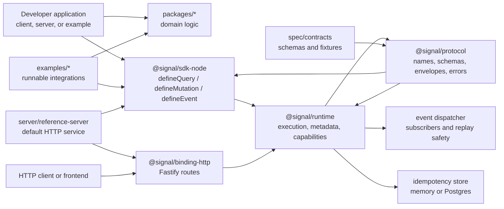

# Signal Developer Documentation

Signal is a TypeScript workspace for building applications around explicit
operational contracts. A Signal application defines:

- **Queries** for reading state.
- **Mutations** for intentional state changes.
- **Events** for facts that already happened.

This document is the developer-oriented source of truth for the repository
shape, module architecture, application build flow, examples, runtime usage,
and validation commands.

## Index

- Repository Map
  - [Folder Structure](#folder-structure)
  - [Module Catalog](#module-catalog)
  - [Architecture](#architecture)
- Core Concepts
  - [Stewardship](#stewardship)
  - [Idempotency](#idempotency)
  - [Events And Subscribers](#events-and-subscribers)
- Build And Use
  - [Install And Build](#install-and-build)
  - [Build An Application On Signal](#build-an-application-on-signal)
  - [HTTP Usage](#http-usage)
  - [Runtime Usage](#runtime-usage)
  - [Examples](#examples)
- Validation
  - [Developer Checks](#developer-checks)

## Folder Structure

The workspace is organized by ownership boundary. Keep new code inside the
folder that owns its runtime responsibility.

| Folder | Owns | Put Code Here When |
| --- | --- | --- |
| `api/` | Client/server interface packages | The package defines protocol, runtime, SDK, HTTP binding, or adapters that both apps and servers can use. |
| `server/` | Backend services and server-only packages | The code runs on the backend, owns persistence, exposes a service, or belongs to the backend pipeline. |
| `examples/` | Runnable examples, browser apps, and example-only integrations | The code demonstrates Signal usage or is not intended as a reusable package API. |
| `packages/` | Reusable domain packages | The package is reusable application/domain logic that is not tied to a specific server, client, or example. |
| `docs/` | Developer documentation | Documentation belongs in this single Markdown file unless generated docs are intentionally introduced later. |
| `spec/` | Protocol RFCs and contract assets | The file captures protocol design decisions, published schemas, or compatibility fixtures. |
| `spec/contracts/schemas/` | Published JSON schemas | The file describes protocol payloads or envelope schemas. |
| `spec/contracts/fixtures/` | Shared contract fixtures | The file is reusable protocol or package test data. |
| `scripts/` | Workspace automation | The script validates or maintains the repo. |

Create a `public/` folder inside an app only when that app owns static assets.
There are no root-level shared public assets in the current workspace.

## Module Catalog

Use this section to choose where a change belongs. The core runtime package is
`api/runtime`; `examples/operation-examples` is only a runnable demo package
named `@signal/examples`.

### API Modules

| Package | Path | Purpose |
| --- | --- | --- |
| `@signal/protocol` | `api/protocol` | Canonical Signal contract surface: operation names, kinds, envelopes, errors, results, capabilities, and JSON schema objects. |
| `@signal/runtime` | `api/runtime` | Core in-process execution: registry, query/mutation/event calls, `run()`/`execute()`, idempotency, subscribers, dispatch, perception, and capability discovery. |
| `@signal/sdk-node` | `api/sdk-node` | Node ergonomics for defining queries, mutations, events, and creating a runtime. |
| `@signal/binding-http` | `api/binding-http` | Fastify routes that adapt HTTP requests into Signal runtime calls. |
| `@signal/idempotency-postgres` | `api/idempotency-postgres` | PostgreSQL-backed idempotency store for retry-safe mutations. |
| `@digelim/signal-protocol` | `api/signal-protocol` | Legacy/demo protocol package with server and client assets; keep compatibility here unless a change belongs to the canonical `@signal/*` API packages. |

### Domain Packages

| Package | Path | Purpose |
| --- | --- | --- |
| `@signal/agency` | `packages/agency` | Agency pipeline primitives for state evaluation, calibration, learning, memory, outcomes, policy, and self-diagnosis. |
| `@signal/commitment` | `packages/commitment` | Generic commitment evaluator that turns decisions, trust, constraints, resources, and policy into recommended commitment. |
| `@signal/decision` | `packages/decision` | Decision intelligence modules: reality, prediction, simulation, outcomes, accountability, coherence, wisdom, human-language summaries, and Stewardship. |
| `@signal/decision-memory` | `packages/decision-memory` | Durable decision memory, learning records, retention, compaction, summaries, Neon/Postgres storage, and Signal memory operations. |
| `@signal/framework` | `packages/framework` | Preserved framework surface with legacy, diagnostics, perception, purpose, meaning, sizing, recovery, wisdom, Stocks Optimizer adapters, and related compatibility modules. |
| `@signal/semantic-state` | `packages/semantic-state` | Semantic-state resolver and bundled lexicon for mapping numeric dimensions to named states. |

### Server Modules

| Package | Path | Purpose |
| --- | --- | --- |
| `@signal/reference-server` | `server/reference-server` | Minimal HTTP service that wires `@signal/examples` operations into `@signal/runtime` and exposes them through `@signal/binding-http`. |
| `@signal/db` | `server/db` | Database scripts, migrations, and adapters used by server-side Signal storage. |
| `@digelim/01.intent` | `server/intent` | Intent module and capability metadata for the older numbered server stack. |
| `@digelim/02.received` | `server/received` | Received-input contracts, errors, and intake helpers. |
| `@digelim/03.validated` | `server/validated` | Validation contracts, errors, and validated-state helpers. |
| `@digelim/04.source` | `server/source` | Source module and source capability metadata. |
| `@digelim/05.pulse` | `server/pulse` | Pulse domain/runtime package for the numbered evaluation flow. |
| `@digelim/06.core` | `server/core` | Core evaluation module and capability metadata. |
| `@digelim/07.action` | `server/action` | Action module and capability metadata. |
| `@digelim/08.result` | `server/result` | Result module and capability metadata. |
| `@digelim/09.sense` | `server/sense` | Sense module and capability metadata. |
| `@digelim/10.app` | `server/app` | Application-level composition of the numbered server modules. |
| `@digelim/11.adapter` | `server/adapter` | Fastify handlers, routes, server setup, and capability route adapters for the numbered stack. |
| `@digelim/12.signal` | `server/signal` | Legacy Signal protocol/runtime/security/observability package used by the numbered stack. |
| `@digelim/13.store` | `server/store` | Store contracts, errors, and in-memory store implementation. |
| `@digelim/14.idempotency` | `server/idempotency` | Idempotency contracts, errors, and in-memory idempotency store. |
| `@digelim/15.sync` | `server/sync` | Synchronization contracts and transport interfaces. |

### Example Modules

| Package | Path | Purpose |
| --- | --- | --- |
| `@signal/examples` | `examples/operation-examples` | Runnable operation, runtime, idempotency, HTTP, storage, Kafka/PostgreSQL, and transport examples. |
| `@signal/aware` | `examples/aware` | Product-style example application that consumes Signal decision and memory packages. |
| `@signal/climate-forecast` | `examples/climate-forecast` | Example-only forecast normalization package used by Weather Awareness. |
| `@signal/emergency-awareness` | `examples/weather-awareness` | Frontend application consuming Signal-style risk and guidance logic. |
| `dyslexia-translator` | `examples/algai` | Standalone example app with its own backend/frontend structure. |
| Stocks Optimizer state | `examples/stocks-optimizer` | Preserved app state in this checkout; it is not currently a pnpm workspace package. |

### Contract Assets

| Path | Purpose |
| --- | --- |
| `spec/RFC-*.md` | Protocol and runtime design records. |
| `spec/contracts/schemas/` | Published JSON schema files for envelopes, results, errors, capabilities, and operation payloads. |
| `spec/contracts/fixtures/protocol/` | Protocol conformance fixtures used by `api/protocol` tests. |
| `spec/contracts/fixtures/commitment/` | Golden commitment fixtures used by `@signal/commitment` tests. |

## Architecture

The diagram below is Mermaid, so Markdown viewers that support Mermaid render it
as an illustration instead of ASCII art.



Dependency direction should stay simple:

- `api/protocol` defines the contract surface.
- `api/runtime` executes the contract surface.
- `api/sdk-node` makes operation definitions ergonomic.
- `api/binding-http` adapts HTTP requests into runtime calls.
- `server/*` composes backend services and persistence.
- `examples/*` consume core packages.
- `packages/*` holds reusable domain logic.

Core packages must not depend on product apps or examples.

## Stewardship

Stewardship is a domain-agnostic layer in `@signal/decision` that helps
applications protect what matters by interpreting memory, outcomes,
governance, threats, protections, and uncertainty.

It sits above the decision-process layers:

```txt
Decision Memory -> Outcome Review -> Governance -> Stewardship
```

Its purpose is to answer:

- What matters?
- What threatens it?
- What protects it?
- What has been learned?
- What remains uncertain?
- What would make this decision safer?
- What is the smallest responsible next step?
- What should be monitored after action?

### Contract

Use `assessStewardship(input: StewardshipInput): StewardshipAssessment`.

The input shape is intentionally generic:

```ts
import { assessStewardship } from "@signal/decision";

const assessment = assessStewardship({
  subject: {
    id: "subject:water-system",
    label: "Water system",
    domain: "infrastructure",
    importance: "critical",
    desiredState: "safe, useful, and available",
  },
  memory: {
    evidence: [],
    lessons: [],
  },
  threats: [],
  protections: [],
  uncertainties: [],
});
```

The output includes:

- `subject`
- `whatMatters`
- `threats`
- `protections`
- `lessons`
- `governance`
- `recommendation`
- `smallestResponsibleNextStep`
- `monitoringPlan`
- `uncertaintySummary`
- `rationale`
- `disclaimers`

Recommendation actions are generic:

```txt
observe | monitor | preserve | proceed_gradually | reduce_exposure |
intervene | pause | stop | review_again
```

### Governance

Governance evaluates whether the decision process is trustworthy enough to
continue. It does not decide whether the decision is correct.

It classifies evidence quality, evidence durability, review depth, repetition
strength, uncertainty visibility, risk visibility, reversibility,
concentration risk, accountability clarity, policy compliance, missing
information, and contradiction level.

### Non-Goals

Stewardship does not make predictions, claim certainty, maximize action, or
issue domain-specific instructions. Product applications must adapt their
domain language at the boundary.

### Integration Pattern

Applications should map their local context into `StewardshipInput`, call
`assessStewardship`, then present the resulting assessment in product language.

Stocks Optimizer is one consumer: it maps capital-preservation goals,
portfolio guardrails, instrument risk, allocation caps, reviewed lessons, and
financial disclaimers into Signal Stewardship. The reusable stewardship logic
remains in Signal.

## Install And Build

Install dependencies from the repository root:

```bash
pnpm install
```

Build everything:

```bash
pnpm build
```

Build only the core runtime surface:

```bash
pnpm --filter @signal/protocol... build
pnpm --filter @signal/runtime... build
pnpm --filter @signal/sdk-node... build
pnpm --filter @signal/binding-http... build
```

Build and run the reference server:

```bash
pnpm --filter @signal/reference-server... build
pnpm --filter @signal/reference-server start
```

The reference server listens on `127.0.0.1:3001` unless `SIGNAL_HTTP_PORT` is
set.

## Build An Application On Signal

1. Choose the owner folder.
   - Backend service: `server/<service-name>`.
   - Reusable domain package: `packages/<package-name>`.
   - Frontend app, runnable demo, or integration: `examples/<example-name>`.

2. Depend on the Signal packages you need.

```json
{
  "dependencies": {
    "@signal/protocol": "workspace:*",
    "@signal/runtime": "workspace:*",
    "@signal/sdk-node": "workspace:*",
    "@signal/binding-http": "workspace:*"
  }
}
```

3. Define operations with schemas and versioned names.

```ts
import { z } from "zod";
import { createSignalHttpServer } from "@signal/binding-http";
import { createProtocolError } from "@signal/protocol";
import { createSignalRuntime, defineEvent, defineMutation, defineQuery } from "@signal/sdk-node";

const orderInputSchema = z.object({
  orderId: z.string().min(1),
});

const orderResultSchema = z.object({
  orderId: z.string().min(1),
  status: z.enum(["draft", "submitted"]),
});

type Order = z.infer<typeof orderResultSchema>;

const orders = new Map<string, Order>([
  ["order_1001", { orderId: "order_1001", status: "draft" }],
]);

const runtime = createSignalRuntime({
  runtimeName: "orders-api",
});

runtime.registerQuery(defineQuery({
  name: "order.get.v1",
  kind: "query",
  inputSchema: orderInputSchema,
  resultSchema: orderResultSchema,
  handler: (input) => {
    const order = orders.get(input.orderId);
    if (!order) {
      throw createProtocolError("NOT_FOUND", `Unknown order ${input.orderId}`);
    }
    return order;
  },
}));

runtime.registerEvent(defineEvent({
  name: "order.submitted.v1",
  kind: "event",
  inputSchema: orderResultSchema,
  resultSchema: orderResultSchema,
  handler: (payload) => payload,
}));

runtime.registerMutation(defineMutation({
  name: "order.submit.v1",
  kind: "mutation",
  idempotency: "required",
  emits: ["order.submitted.v1"],
  inputSchema: orderInputSchema,
  resultSchema: orderResultSchema,
  handler: async (input, context) => {
    const order = orders.get(input.orderId);
    if (!order) {
      throw createProtocolError("NOT_FOUND", `Unknown order ${input.orderId}`);
    }

    order.status = "submitted";
    await context.emit("order.submitted.v1", order);
    return order;
  },
}));

const app = createSignalHttpServer(runtime);
await app.listen({ port: 3001, host: "127.0.0.1" });
```

4. Add tests around the runtime, not only around HTTP.

```ts
const result = await runtime.query("order.get.v1", {
  orderId: "order_1001",
});
```

5. Add HTTP tests when you expose an application server.

```ts
const response = await app.inject({
  method: "POST",
  url: "/signal/query/order.get.v1",
  payload: {
    payload: {
      orderId: "order_1001",
    },
  },
});
```

## HTTP Usage

The default HTTP binding exposes:

| Method | Path | Purpose |
| --- | --- | --- |
| `GET` | `/health` | Basic process health. |
| `GET` | `/signal/capabilities` | Runtime operation discovery. |
| `POST` | `/signal/query/:name` | Execute a query. |
| `POST` | `/signal/mutation/:name` | Execute a mutation. |
| `GET` | `/signal/observed-events` | Reference-server observed event list. |

Request bodies use this shape:

```json
{
  "payload": {},
  "context": {
    "correlationId": "corr-1001",
    "traceId": "trace-1001"
  },
  "meta": {},
  "idempotencyKey": "logical-request-1001"
}
```

Query example:

```bash
curl -X POST http://127.0.0.1:3001/signal/query/note.get.v1 \
  -H 'content-type: application/json' \
  -d '{"payload":{"noteId":"note_1001"}}'
```

Mutation example:

```bash
curl -X POST http://127.0.0.1:3001/signal/mutation/post.publish.v1 \
  -H 'content-type: application/json' \
  -d '{"payload":{"postId":"post_1001","title":"Protocol first","body":"Signal keeps transport and execution concerns separate."},"idempotencyKey":"publish-post_1001-001"}'
```

Successful responses preserve the same envelope shape:

```json
{
  "ok": true,
  "result": {},
  "envelope": {},
  "meta": {}
}
```

Failures use:

```json
{
  "ok": false,
  "error": {
    "code": "BAD_REQUEST",
    "category": "validation",
    "message": "Invalid Signal HTTP request body",
    "retryable": false
  }
}
```

## Runtime Usage

Use `runtime.capabilities()` to inspect registered operations:

```ts
const capabilities = runtime.capabilities();
```

Use direct runtime calls when testing or embedding Signal inside another
service:

```ts
await runtime.query("note.get.v1", { noteId: "note_1001" });

await runtime.mutation(
  "post.publish.v1",
  {
    postId: "post_1001",
    title: "Protocol first",
    body: "Signal keeps transport and execution concerns separate.",
  },
  {
    idempotencyKey: "publish-post_1001-001",
    correlationId: "corr-post-1001",
  }
);
```

Operation naming rules:

- Use `domain.action.v1` or `resource.fact.v1`.
- Add a new version instead of changing an existing public contract.
- Use query names for reads, mutation names for commands, and event names for
  completed facts.
- Keep payload schemas explicit with `zod`.

## Idempotency

Mutations can declare idempotency as `required`, `optional`, or `none`.

Use required idempotency when callers may retry the same logical mutation:

```ts
runtime.registerMutation(defineMutation({
  name: "payment.capture.v1",
  kind: "mutation",
  idempotency: "required",
  inputSchema,
  resultSchema,
  handler,
}));
```

Local examples can use the in-memory store. Production-like services should use
`@signal/idempotency-postgres` and set `DATABASE_URL`.

```ts
import { createPostgresIdempotencyStore } from "@signal/idempotency-postgres";
import { createSignalRuntime } from "@signal/sdk-node";

const runtime = createSignalRuntime({
  idempotencyStore: createPostgresIdempotencyStore({
    connectionString: process.env.DATABASE_URL,
  }),
});
```

## Events And Subscribers

Events record facts. They should be named in past tense:

- `post.published.v1`
- `payment.captured.v1`
- `order.submitted.v1`

Emit from a mutation through the execution context:

```ts
await context.emit("post.published.v1", {
  postId: "post_1001",
  title: "Protocol first",
  publishedAt: new Date().toISOString(),
});
```

Subscribe when an event must update a projection or notify another system:

```ts
runtime.subscribe("post.published.v1", async (event) => {
  console.log(event.messageId);
}, {
  consumerId: "post-projection",
  replaySafe: true,
});
```

Subscriber code must be replay-safe. Store enough metadata to avoid duplicating
side effects when the same event is delivered again.

## Examples

Build the operation examples first:

```bash
pnpm --filter @signal/examples... build
```

Runnable examples in `examples/operation-examples`:

| Example | Command | Notes |
| --- | --- | --- |
| Minimal runtime | `pnpm --filter @signal/examples minimal-runtime` | Registers and executes `note.get.v1`. |
| Post publication | `pnpm --filter @signal/examples post-publication` | Query, mutation, emitted event, replay, and idempotency conflict. |
| HTTP post publication | `pnpm --filter @signal/examples http-post-publication` | Uses the Fastify HTTP binding with injected requests. |
| Capabilities inspection | `pnpm --filter @signal/examples capabilities-inspection` | Prints registered operation capabilities. |
| Storage-backed idempotency | `DATABASE_URL=postgresql://... pnpm --filter @signal/examples storage-backed-idempotency` | Requires PostgreSQL. |
| Custom transport skeleton | `pnpm --filter @signal/examples custom-transport-skeleton` | Shows where a non-HTTP transport plugs in. |
| Payment capture | `pnpm --filter @signal/examples payment-capture` | Payment-style mutation and event flow. |
| Escrow release | `pnpm --filter @signal/examples escrow-release` | Multi-step domain workflow. |
| User onboarding | `pnpm --filter @signal/examples user-onboarding` | User lifecycle flow. |
| Kafka/PostgreSQL | `DATABASE_URL=postgresql://... KAFKA_BROKERS=localhost:9092 pnpm --filter @signal/examples kafka-postgresql` | Uses PostgreSQL and Kafka-compatible brokers. |

Application examples:

| Example | Path | Command | Live URL |
| --- | --- | --- | --- |
| Aware | `examples/aware` | `pnpm --filter @signal/aware dev` | <https://aware-guide.vercel.app> |
| Climate Forecast | `examples/climate-forecast` | `pnpm --filter @signal/climate-forecast test` | Code/package example; no Vercel app. |
| Emergency Awareness | `examples/weather-awareness` | `pnpm --filter @signal/emergency-awareness dev` | <https://weather-awareness.vercel.app> |
| Stocks Optimizer | `examples/stocks-optimizer` | Preserved example state in this checkout; it is not currently a pnpm workspace package. | <https://stocks-optimizer.vercel.app> |

Reference server:

```bash
pnpm --filter @signal/reference-server... build
pnpm --filter @signal/reference-server start
```

## Developer Checks

Use these before publishing structural or contract changes:

```bash
pnpm test
pnpm -r --if-present --sort run test:coverage
pnpm typecheck
pnpm lint
pnpm verify:exports
git diff --check && git diff --cached --check
```

Use these targeted checks while developing:

```bash
pnpm --filter @signal/protocol test
pnpm --filter @signal/runtime test
pnpm --filter @signal/sdk-node test
pnpm --filter @signal/binding-http test
pnpm --filter @signal/reference-server test
pnpm --filter @signal/examples test
```

`pnpm verify:exports` checks package `main`, `types`, `exports`, and `bin`
targets for all workspace packages. Run it after moving packages or changing
build output paths.
