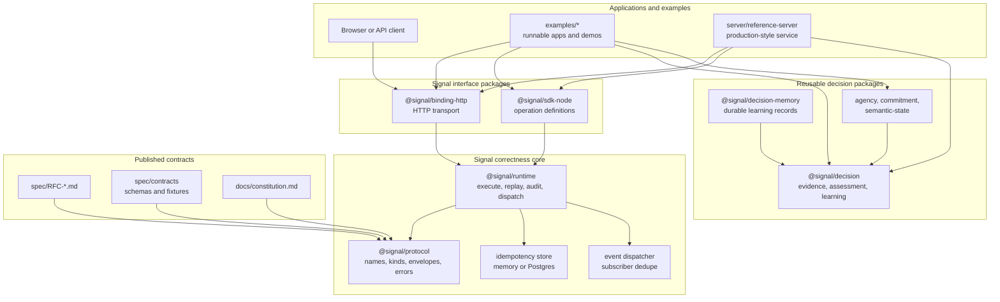

# Signal Developer Documentation

Signal makes dangerous backend operations explicit, replay-safe, and
auditable.

It is a production correctness standard for versioned Queries, Mutations, and
Events. The decision-quality packages still help applications reason under
uncertainty, but the adoption-critical surface is the correctness layer around
dangerous backend operations.

Signal also provides explicit operational contracts:

- **Queries** read state.
- **Mutations** make intentional state changes.
- **Events** record facts that already happened.

This document is the developer-oriented source of truth for the repository
shape, operation contracts, reference proof, application build flow, examples,
runtime usage, focused architecture audits, and validation commands.

## Fast Orientation

In 10 seconds: Signal makes dangerous backend operations explicit,
replay-safe, and auditable.

In 30 seconds: applications define reads as Queries, dangerous state changes as
Mutations, and completed facts as Events. Signal gives those operations stable
names, schemas, idempotency, replay metadata, subscriber dedupe, audit evidence,
and certification.

In 5 minutes after dependencies are installed:

1. Run `pnpm proof:reference`.
2. Observe `payment.capture.v1` execute as a high-risk mutation.
3. Observe safe retry and replay with the same idempotency key.
4. Observe conflict with the same idempotency key and changed intent.
5. Observe redacted audit, outbox, subscriber dedupe, and certification evidence.

If a new engineer cannot explain the system with the line below, the docs or
the change are too complicated:

```txt
Signal makes dangerous backend operations explicit, replay-safe, and auditable.
```

## Index

- Repository Map
  - [Constitution](#constitution)
  - [Folder Structure](#folder-structure)
  - [Module Catalog](#module-catalog)
  - [Architecture](#architecture)
  - [Focused Audits](#focused-audits)
- Core Concepts
  - [Decision Quality](#decision-quality)
  - [Learning-Informed Judgment](#learning-informed-judgment)
  - [Decision Operation Catalog](#decision-operation-catalog)
  - [Stewardship Ledger](#stewardship-ledger)
  - [Idempotency](#idempotency)
  - [Events And Subscribers](#events-and-subscribers)
- Build And Use
  - [Install And Build](#install-and-build)
  - [Reference Proof](#reference-proof)
  - [Build An Application On Signal](#build-an-application-on-signal)
  - [Extend Correctly](#extend-correctly)
  - [HTTP Usage](#http-usage)
  - [Runtime Usage](#runtime-usage)
  - [Operate Safely In Production](#operate-safely-in-production)
  - [Examples](#examples)
- Validation
  - [Developer Checks](#developer-checks)

## Constitution

Read [docs/constitution.md](constitution.md) before changing shared Signal
behavior. The short version is:

- Signal is a correctness layer.
- Signal is protocol-first and transport-independent.
- Queries, Mutations, and Events are explicit contracts.
- Dangerous mutations must declare risk.
- Production guarantees require executable evidence.
- Simplicity beats flexibility.

## Folder Structure

The workspace is organized by ownership boundary. Keep new code inside the
folder that owns its runtime responsibility.

| Folder | Owns | Put Code Here When |
| --- | --- | --- |
| `api/` | Client/server interface packages | The package defines protocol, runtime, SDK, HTTP binding, or adapters that both apps and servers can use. |
| `server/` | Backend services and server-only packages | The code runs on the backend, owns persistence, exposes a service, or belongs to the backend pipeline. |
| `examples/` | Runnable examples, browser apps, and example-only integrations | The code demonstrates Signal usage or is not intended as a reusable package API. |
| `frontend/` | Reserved local frontend support | Keep shared frontend helpers here only when they are not an app, package, or published workspace module. Current runnable frontends live in `examples/`. |
| `packages/` | Reusable domain packages | The package is reusable application/domain logic that is not tied to a specific server, client, or example. |
| `docs/` | Developer documentation | Orientation belongs in `docs/README.md`, rules belong in `docs/constitution.md`, and narrow audit notes belong in focused `docs/*-audit.md` files. |
| `spec/` | Protocol RFCs and contract assets | The file captures protocol design decisions, published schemas, or compatibility fixtures. |
| `spec/contracts/schemas/` | Published JSON schemas | The file describes protocol payloads or envelope schemas. |
| `spec/contracts/fixtures/` | Shared contract fixtures | The file is reusable protocol or package test data. |
| `scripts/` | Workspace automation | The script validates or maintains the repo. |

Create a `public/` folder inside an app only when that app owns static assets.
There are no root-level shared public assets in the current workspace.

## Module Catalog

Use this section to choose where a change belongs. The core runtime package is
`api/runtime`; `examples/operation-examples` is only a runnable demo package
named `@signal/examples`.

### API Modules

| Package | Path | Purpose |
| --- | --- | --- |
| `@signal/protocol` | `api/protocol` | Canonical Signal contract surface: operation names, kinds, envelopes, errors, results, capabilities, and JSON schema objects. |
| `@signal/runtime` | `api/runtime` | Core in-process execution: registry, query/mutation/event calls, `run()`/`execute()`, idempotency, subscribers, dispatch, perception, and capability discovery. |
| `@signal/sdk-node` | `api/sdk-node` | Node ergonomics for defining queries, mutations, events, and creating a runtime. |
| `@signal/binding-http` | `api/binding-http` | Fastify routes that adapt HTTP requests into Signal runtime calls. |
| `@signal/idempotency-postgres` | `api/idempotency-postgres` | PostgreSQL-backed idempotency store for retry-safe mutations. |

### Domain Packages

| Package | Path | Purpose |
| --- | --- | --- |
| `@signal/agency` | `packages/agency` | Agency pipeline primitives for state evaluation, calibration, learning, memory, outcomes, policy, and self-diagnosis. |
| `@signal/commitment` | `packages/commitment` | Generic commitment evaluator that turns decisions, trust, constraints, resources, and policy into recommended commitment. |
| `@signal/decision` | `packages/decision` | Domain-agnostic decision-quality model. New code should prefer the `@signal/decision/core` subpath for evidence assessment, confidence caps, journals, outcome reviews, learning, records, coherence, and pipeline evaluation. |
| `@signal/decision-memory` | `packages/decision-memory` | Durable decision memory, learning records, retention, compaction, summaries, Neon/Postgres storage, and Signal memory operations. |
| `@signal/semantic-state` | `packages/semantic-state` | Semantic-state resolver and bundled lexicon for mapping numeric dimensions to named states. |

### Server Modules

| Package | Path | Purpose |
| --- | --- | --- |
| `@signal/reference-server` | `server/reference-server` | Minimal HTTP service that registers local reference operations, exposes them through `@signal/binding-http`, and proves the high-risk payment-capture path. |
| `@signal/db` | `server/db` | Database scripts, migrations, and adapters used by server-side Signal storage. |

### Example Modules

| Package | Path | Purpose |
| --- | --- | --- |
| `@signal/examples` | `examples/operation-examples` | Runnable operation, runtime, idempotency, HTTP, storage, Kafka/PostgreSQL, and transport examples. |
| `@signal/aware` | `examples/aware` | Product-style example application that consumes Signal decision and memory packages. |
| `@signal/algai-parent-dashboard` | `examples/algai-parent-dashboard` | Parent-facing AlgAI dashboard example built with Vite and React. |
| `dyslexia-translator` | `examples/algai` | Standalone example app with its own backend/frontend structure. |
| Stocks Optimizer | `examples/stocks-optimizer` | Recovered application workspace. Its `@workspace/signal-markets` app maps investment concepts into generic Signal contracts through an adapter. |

### Contract Assets

| Path | Purpose |
| --- | --- |
| `spec/RFC-*.md` | Protocol and runtime design records. |
| `spec/contracts/schemas/` | Published JSON schema files for envelopes, results, errors, capabilities, and operation payloads. |
| `spec/contracts/fixtures/protocol/` | Protocol conformance fixtures used by `api/protocol` tests. |
| `spec/contracts/fixtures/commitment/` | Golden commitment fixtures used by `@signal/commitment` tests. |

## Architecture

The diagram below is Mermaid, so Markdown viewers that support Mermaid render it
as an illustration instead of ASCII art.



Dependency direction should stay simple:

- `api/protocol` defines the contract surface.
- `api/runtime` executes the contract surface.
- `api/sdk-node` makes operation definitions ergonomic.
- `api/binding-http` adapts HTTP requests into runtime calls.
- `server/*` composes backend services and persistence.
- `examples/*` consume core packages and own runnable frontend/product demos.
- `frontend/*` is not a workspace package today; keep production app code in
  `examples/*` unless the workspace shape changes.
- `packages/*` holds reusable domain logic that can feed applications through
  adapters.

Core packages must not depend on product apps or examples.

## Focused Audits

Keep the docs front door short. When a change needs deeper quality or
architecture evidence, add a focused audit document and link it here.

| Document | Purpose |
| --- | --- |
| [Constitution](constitution.md) | Signal's correctness rules, category boundaries, and evidence rule. |
| [Stewardship Evolution Audit](stewardship-evolution-audit.md) | Assessment of the decision stewardship ledger batch, remaining persistence/UI boundaries, and validation evidence. |

## Decision Quality

`@signal/decision` is the reusable package for decisions under uncertainty.
New work should start from the simple model below and use the older scenario,
wisdom, stewardship, and memory helpers only when they support that model.

```txt
Evidence -> Assessment -> Decision -> Outcome -> Learning
```

### Evidence

Evidence is any observable reason a decision might be reasonable or unsafe.
Signal keeps evidence domain-agnostic. Applications translate domain language
into generic evidence fields:

- `quality`
- `reliability`
- `freshness`
- `independence`
- `replication`
- `calibration`
- `traceability`
- `direction`: `supporting`, `contradicting`, or `neutral`

### Assessment

Assessment makes uncertainty visible before action. It distinguishes:

- `known`
- `unknowns`
- `assumptions`
- `contradicted`

Use `assessDecisionEvidence(input)` when an application needs a lightweight,
auditable assessment:

```ts
import { assessDecisionEvidence } from "@signal/decision";

const assessment = assessDecisionEvidence({
  decisionId: "decision:demo",
  evidence: [
    {
      label: "Direct observation",
      direction: "supporting",
      quality: 72,
      reliability: 75,
      freshness: 82,
      independence: 60,
      replication: 50,
      calibration: 68,
      traceability: 90,
    },
  ],
  known: ["The current state is observable."],
  unknowns: ["Whether the condition will persist."],
  assumptions: ["The observation remains relevant long enough to act."],
  desiredConfidence: 85,
  reversibility: "high",
});
```

The assessment returns:

- `evidenceQuality`: evidence quality, reliability, freshness, independence,
  replication, contradiction pressure, calibration, traceability, and coverage.
- `confidence`: requested confidence, capped confidence, and the cap sources.
- `governance`: derived auditability, explainability, challengeability,
  traceability, evidence coverage, contradiction visibility, and assumption
  visibility.
- `stewardship`: derived importance, threat pressure, optionality, resilience,
  reversibility, and a conservative recommendation.
- `nextBestEvidence`: the one piece of information that would most improve the
  decision.
- `journal`: evidence, assumptions, contradictions, unknowns, and reasoning
  captured before the outcome is known.

Confidence must not exceed evidence quality. Contradictions, exposed
assumptions, and unresolved unknowns can lower the cap further. This protects
honesty; it does not try to be pessimistic.

### Decision

Use `evaluateDecision(input)` when the assessment should flow into the existing
decision pipeline:

```ts
import { evaluateDecision } from "@signal/decision";

const result = evaluateDecision({
  decisionId: "decision:demo",
  observation: { source: "example" },
  modules: {
    discovery: 78,
    judgment: 74,
    purpose: 80,
    need: 70,
    trust: 68,
    recovery: 75,
    calibration: 72,
    agency: 62,
  },
  assessment: {
    evidence: [{ label: "Traceable signal", quality: 64, traceability: 90 }],
    unknowns: ["Whether it repeats."],
    assumptions: ["The signal is not noise."],
    desiredConfidence: 90,
    reversibility: "medium",
  },
});
```

When `assessment` is supplied, pipeline confidence is capped by the assessment.
The decision record keeps the journal so later outcome reviews are protected
from hindsight bias.

### Outcome

Outcome review answers practical questions:

- What happened?
- What surprised us?
- Which assumptions failed?
- Which assumptions survived?
- Which evidence mattered?
- Which evidence misled us?
- What should change next time?

Use `reviewDecisionOutcome(input)` directly or pass `review` into
`evaluateOutcome(input)`.

```ts
import { reviewDecisionOutcome } from "@signal/decision";

const review = reviewDecisionOutcome({
  decisionId: "decision:demo",
  whatHappened: "The action worked briefly, then failed.",
  why: "Freshness decayed faster than expected.",
  assumptions: [
    { assumptionId: "assumption:fresh", label: "Evidence stays fresh", status: "failed" },
  ],
  evidence: [
    { evidenceId: "evidence:direct", label: "Direct observation", role: "mattered" },
  ],
  whatShouldChange: "Require a freshness check before repeating.",
});
```

### Learning

Learning stays deliberately small:

```txt
What happened?
Why?
What should change?
```

Repeated lessons can be derived with `deriveLearningPatterns(learnings)`.
Patterns track frequency, confirmations, contradictions, and survival rate.
They improve explanations and process quality; they must not inflate decision
confidence.

## Learning-Informed Judgment

`@signal/decision/core` also exposes a generic judgment infrastructure for
reviewed historical learning. It extends the simple decision-quality model
without turning Signal into an application or a prediction engine.

The universal lifecycle is:

```txt
Objective
-> Resources
-> Allocation
-> Position
-> State
-> Evaluation
-> Constraints
-> Threats
-> Assumptions
-> Similarity
-> Reviewed History
-> Judgment
-> Tradeoffs
-> Strategies
-> Execution
-> Outcome
-> Observation
-> Review
-> Verification
-> Lesson
```

Signal core owns the generic contracts in that lifecycle. Adapters own domain
mappings and terminology. Applications own workflows, UX, and product-specific
behavior. Stocks Optimizer is an application and adapter; Signal must never
depend on it.

### Relationship Memory

Relationships are institutional memory, not loose metadata. A relationship
connects a source entity to a target entity with a typed relation such as
`supports`, `contradicts`, `limits`, `validates`, `refutes`, `resembles`,
`generated`, or `applies_to`. Use:

```ts
import { createSignalRelationshipMemory } from "@signal/decision/core";

const memory = createSignalRelationshipMemory(relationships);
const lineage = memory.lineage("judgment:current");
```

The lineage tells an application which reviews, lessons, similarities, and
judgments explain why entities are connected.

### Similarity And Reviewed History

Similarity transfers reviewed learning into present judgment. It answers:

- What resembles this?
- What happened previously?
- Which lessons survived?
- Which assumptions repeatedly failed?
- Which strategies repeatedly succeeded or failed?

Similarity is not prediction. It does not say what will happen. It says which
reviewed situations are relevant enough to inform today's judgment.

Reviewed history may contain prior decisions, outcomes, reviews, assumptions,
lessons, and relationships. Signal should prefer reviewed history over
speculative explanations.

### Lesson Survival

Lessons track review count, survival count, failure count, confidence,
applicability, and domain coverage. `assessSignalLessonSurvival(lessons)` ranks
lessons so repeated, reviewed, surviving lessons are preferred over persuasive
but unreviewed explanations.

Outcome, Review, Verification, and Lesson remain separate concepts:

- Outcome records what happened.
- Review explains why it happened and what should change.
- Verification checks whether a claim or target is valid.
- Lesson is reusable learning extracted from review.

Strategy quality and execution quality are separate too. A good strategy can be
poorly executed, and clean execution can still apply a weak strategy.

### Generic Learning Example

```ts
import { evaluateLearningJudgment } from "@signal/decision/core";

const result = evaluateLearningJudgment({
  objective: {
    id: "objective:capacity",
    type: "Objective",
    label: "Keep service capacity resilient",
    traceRefs: [],
    reviewRefs: [],
    explanation: ["Generic objective."],
  },
  currentTags: ["capacity-pressure", "reversible-action"],
  evidence: [{
    id: "evidence:load",
    type: "Evidence",
    label: "Recent load is observable",
    traceRefs: [],
    reviewRefs: [],
    explanation: ["Current evidence."],
    strength: 76,
    confidence: 72,
  }],
  reviewedSituations: [{
    id: "situation:reviewed-capacity",
    label: "reviewed reversible capacity change",
    tags: ["capacity-pressure", "reversible-action"],
    reviewRef: { reviewId: "review:past-capacity", outcome: "survived" },
    lessonRefs: ["lesson:keep-reversible"],
  }],
  lessons: [{
    id: "lesson:keep-reversible",
    type: "Lesson",
    label: "Keep reversible changes small until evidence repeats",
    traceRefs: [],
    reviewRefs: [{ reviewId: "review:past-capacity", outcome: "survived" }],
    explanation: ["Repeatedly survived review."],
    reviewCount: 3,
    survivalCount: 3,
    failureCount: 0,
    confidence: 78,
    applicability: ["capacity-pressure", "reversible-action"],
    domainCoverage: ["operations"],
  }],
});

console.log(result.judgment.futureOutcomeRequired); // false
console.log(result.rationale);
```

This produces current state, evaluation, similarity matches, reviewed history,
judgment, tradeoffs, strategies, and rationale without waiting for a new
outcome.

### Stocks Optimizer Boundary

Stocks Optimizer should translate its domain outside Signal core:

```txt
ticker                    -> domain identifier
price + shares            -> position
portfolio exposure        -> state
volatility                -> evaluation
market risk               -> threat
investment thesis         -> assumption
allocation adjustment     -> strategy
investment outcome        -> outcome
postmortem                -> review
investment lesson         -> lesson
```

The app can then call `evaluateLearningJudgment` with generic Signal
contracts. User-facing output should emphasize reviewed history, similarity,
surviving lessons, uncertainty, reversibility, optionality, and allocation
discipline. Prefer language like "This resembles...", "Previously reviewed
situations suggest...", and "The strongest surviving lesson is...". Avoid
certainty, guaranteed outcomes, and buy/sell directives in Signal-generated
judgment text.

Signal remains infrastructure. Stocks Optimizer consumes Signal through an
adapter and owns all investment terminology, data sources, APIs, and UI.

### Ownership Boundary

Signal owns:

- evidence
- assessment
- decisions
- outcome reviews
- learning

Applications own:

- domain language
- domain APIs
- domain UX
- domain metrics

Adapters translate application-specific facts into Signal's generic fields.
For example, Stocks Optimizer should translate market, portfolio, and broker
details into supporting evidence, contradictory evidence, assumptions,
unknowns, and next-best evidence. AlgAI should translate student progress,
learning constraints, parent/educator concerns, unknowns, and next actions into
the same generic model.

### Decision API Surface

Use `@signal/decision/core` for new application code:

```ts
import { assessDecisionEvidence, evaluateDecision, reviewDecisionOutcome } from "@signal/decision/core";
```

The root `@signal/decision` export remains broad for existing consumers. Older
names such as scenario, prediction, simulation, stewardship, and memory helpers
should be interpreted as compatibility surfaces or derived views. Prefer the
evidence-centered core subpath for new code.

## Decision Operation Catalog

`@signal/decision` also exposes a versioned operation catalog for applications
that want to register decision behavior into a Signal-style registry:

```ts
import {
  listDecisionOperations,
  registerDecisionOperations,
} from "@signal/decision";

const operations = listDecisionOperations();
console.log(operations.map((operation) => operation.name));

const registry = {
  registerQuery(definition: { name: string }) {
    console.log(definition.name);
  },
  registerMutation(definition: { name: string }) {
    console.log(definition.name);
  },
  registerEvent(definition: { name: string }) {
    console.log(definition.name);
  },
};

registerDecisionOperations(registry);
```

The catalog includes decision records, evaluation, replay, outcome recording,
memory compaction, accountability, scenario exploration, simulation, and related
decision events. These definitions are a catalog and compatibility surface; an
application still owns the concrete storage, transport, and product language.

## Stewardship Ledger

The stewardship layer now carries a traceability ledger. Use
`assessment.ledger` or `createStewardshipLedger(input)` when a product needs to
show which decisions, outcome reviews, lessons, evidence, threats, and
protections support a recommendation.

The ledger reports:

- traceability score
- missing decision or outcome links
- missing evidence references
- warnings for threats or protections without evidence

Persist ledger summaries through existing decision-memory storage when durable
history is needed. Do not create a separate stewardship database or add
domain-specific labels to shared Signal schemas.

## Install And Build

Install dependencies from the repository root:

```bash
pnpm install
```

Build everything:

```bash
pnpm build
```

Build only the core runtime surface:

```bash
pnpm --filter @signal/protocol... build
pnpm --filter @signal/runtime... build
pnpm --filter @signal/sdk-node... build
pnpm --filter @signal/binding-http... build
```

Build and run the reference server:

```bash
pnpm --filter @signal/reference-server... build
pnpm --filter @signal/reference-server start
```

The reference server listens on `127.0.0.1:3001` unless `SIGNAL_HTTP_PORT` is
set.

## Reference Proof

Run the local proof from the repository root:

```bash
pnpm proof:reference
```

The proof executes the complete high-risk path:

- confirms `payment.capture.v1` is declared as a required-idempotency mutation
  that emits `payment.captured.v1`
- proves authorization runs before idempotency reservation
- executes the dangerous payment-capture mutation
- retries the same logical request and observes replay
- changes the normalized payload and observes `IDEMPOTENCY_CONFLICT`
- observes redacted audit evidence, outbox evidence, and subscriber delivery
- verifies another tenant cannot read the evidence
- re-dispatches the event and observes subscriber dedupe
- runs `reference.certification.v1`

This is the five-minute adoption path. If this proof becomes hard to run or
hard to explain, fix that before adding features.

For a production-like idempotency proof, set `DATABASE_URL` and run:

```bash
pnpm proof:reference:postgres
```

This uses the PostgreSQL idempotency store and fails fast if `DATABASE_URL` is
not set. Run the idempotency migration before using a fresh database:

```bash
pnpm db:migrate
```

## Build An Application On Signal

1. Choose the owner folder.
   - Backend service: `server/<service-name>`.
   - Reusable domain package: `packages/<package-name>`.
   - Frontend app, runnable demo, or integration: `examples/<example-name>`.

2. Depend on the Signal packages you need.

```json
{
  "dependencies": {
    "@signal/protocol": "workspace:*",
    "@signal/runtime": "workspace:*",
    "@signal/sdk-node": "workspace:*",
    "@signal/binding-http": "workspace:*"
  }
}
```

3. Define operations with schemas and versioned names.

```ts
import { z } from "zod";
import { createSignalHttpServer } from "@signal/binding-http";
import { createProtocolError } from "@signal/protocol";
import { createSignalRuntime, defineEvent, defineMutation, defineQuery } from "@signal/sdk-node";

const orderInputSchema = z.object({
  orderId: z.string().min(1),
});

const orderResultSchema = z.object({
  orderId: z.string().min(1),
  status: z.enum(["draft", "submitted"]),
});

type Order = z.infer<typeof orderResultSchema>;

const orders = new Map<string, Order>([
  ["order_1001", { orderId: "order_1001", status: "draft" }],
]);

const runtime = createSignalRuntime({
  runtimeName: "orders-api",
});

runtime.registerQuery(defineQuery({
  name: "order.get.v1",
  kind: "query",
  inputSchema: orderInputSchema,
  resultSchema: orderResultSchema,
  handler: (input) => {
    const order = orders.get(input.orderId);
    if (!order) {
      throw createProtocolError("NOT_FOUND", `Unknown order ${input.orderId}`);
    }
    return order;
  },
}));

runtime.registerEvent(defineEvent({
  name: "order.submitted.v1",
  kind: "event",
  inputSchema: orderResultSchema,
  resultSchema: orderResultSchema,
  handler: (payload) => payload,
}));

runtime.registerMutation(defineMutation({
  name: "order.submit.v1",
  kind: "mutation",
  idempotency: "required",
  emits: ["order.submitted.v1"],
  inputSchema: orderInputSchema,
  resultSchema: orderResultSchema,
  handler: async (input, context) => {
    const order = orders.get(input.orderId);
    if (!order) {
      throw createProtocolError("NOT_FOUND", `Unknown order ${input.orderId}`);
    }

    order.status = "submitted";
    await context.emit("order.submitted.v1", order);
    return order;
  },
}));

const app = createSignalHttpServer(runtime);
await app.listen({ port: 3001, host: "127.0.0.1" });
```

4. Add tests around the runtime, not only around HTTP.

```ts
const result = await runtime.query("order.get.v1", {
  orderId: "order_1001",
});
```

5. Add HTTP tests when you expose an application server.

```ts
const response = await app.inject({
  method: "POST",
  url: "/signal/query/order.get.v1",
  payload: {
    payload: {
      orderId: "order_1001",
    },
  },
});
```

## Extend Correctly

Use this checklist before adding or changing Signal behavior:

- Put code in the folder that owns the responsibility: protocol in `api/`,
  backend and persistence in `server/`, reusable decision logic in `packages/`,
  and product-specific language or UI in an application.
- Keep core Signal packages domain-agnostic. Convert domain facts into generic
  evidence, assumptions, unknowns, contradictions, decisions, outcomes, and
  learning records.
- Add a new operation version instead of changing the input, output, or meaning
  of an existing public operation.
- Validate handler input and output with schemas.
- Make mutations idempotent when callers may retry them.
- Emit events only for facts that have already happened.
- Keep subscriber side effects replay-safe.
- Preserve trace, correlation, causation, and idempotency metadata across nested
  work.
- Run the targeted package tests and the library checks before publishing a
  shared change.

Correct extension usually means adding less than expected: translate domain
complexity at the application boundary, then reuse the smallest Signal contract
that proves what changed.

## HTTP Usage

The default HTTP binding exposes:

| Method | Path | Purpose |
| --- | --- | --- |
| `GET` | `/health` | Basic process health. |
| `GET` | `/signal/capabilities` | Runtime operation discovery. |
| `POST` | `/signal/query/:name` | Execute a query. |
| `POST` | `/signal/mutation/:name` | Execute a mutation. |
| `GET` | `/signal/observed-events` | Reference-server observed event list. |

The reference server intentionally exposes two kinds of operations:

- minimal smoke/demo operations: `note.get.v1`, `post.get.v1`,
  `post.publish.v1`, and `post.published.v1`
- the adoption proof operations: `payment.capture.v1`,
  `payment.capture.get.v1`, `payment.captured.v1`, and
  `reference.certification.v1`

Request bodies use this shape:

```json
{
  "payload": {},
  "context": {
    "correlationId": "corr-1001",
    "traceId": "trace-1001"
  },
  "meta": {},
  "idempotencyKey": "logical-request-1001"
}
```

Query example:

```bash
curl -X POST http://127.0.0.1:3001/signal/query/note.get.v1 \
  -H 'content-type: application/json' \
  -d '{"payload":{"noteId":"note_1001"}}'
```

High-risk mutation example:

```bash
curl -X POST http://127.0.0.1:3001/signal/mutation/payment.capture.v1 \
  -H 'content-type: application/json' \
  -d '{"idempotencyKey":"tenant_acme:capture:docs","auth":{"actor":{"id":"ops_alice"},"subject":"tenant:tenant_acme","scopes":["payment:capture","tenant:tenant_acme"]},"payload":{"tenantId":"tenant_acme","authorizationId":"auth_docs","amountCents":12500,"currency":"USD","paymentMethod":{"token":"tok_live_secret","last4":"4242"},"risk":{"declared":true,"classification":"high","reason":"Customer-visible payment capture moves funds.","approvedBy":"ops_alice"}}}'
```

Successful responses preserve the same envelope shape:

```json
{
  "ok": true,
  "result": {},
  "envelope": {},
  "meta": {}
}
```

Failures use:

```json
{
  "ok": false,
  "error": {
    "code": "BAD_REQUEST",
    "category": "validation",
    "message": "Invalid Signal HTTP request body",
    "retryable": false
  }
}
```

## Runtime Usage

Use `runtime.capabilities()` to inspect registered operations:

```ts
const capabilities = runtime.capabilities();
```

Use direct runtime calls when testing or embedding Signal inside another
service:

```ts
await runtime.query("note.get.v1", { noteId: "note_1001" });

await runtime.mutation(
  "post.publish.v1",
  {
    postId: "post_1001",
    title: "Protocol first",
    body: "Signal keeps transport and execution concerns separate.",
  },
  {
    idempotencyKey: "publish-post_1001-001",
    correlationId: "corr-post-1001",
  }
);
```

High-risk runtime calls should pass auth, tenant, correlation, and idempotency
metadata explicitly:

```ts
await runtime.mutation(
  "payment.capture.v1",
  {
    tenantId: "tenant_acme",
    authorizationId: "auth_runtime_docs",
    amountCents: 12500,
    currency: "USD",
    paymentMethod: { token: "tok_live_secret", last4: "4242" },
    risk: {
      declared: true,
      classification: "high",
      reason: "Customer-visible payment capture moves funds.",
      approvedBy: "ops_alice",
    },
  },
  {
    idempotencyKey: "tenant_acme:capture:runtime_docs",
    correlationId: "corr-runtime-docs",
    auth: {
      actor: { id: "ops_alice" },
      subject: "tenant:tenant_acme",
      scopes: ["payment:capture", "tenant:tenant_acme"],
    },
  }
);
```

Operation naming rules:

- Use `domain.action.v1` or `resource.fact.v1`.
- Add a new version instead of changing an existing public contract.
- Use query names for reads, mutation names for commands, and event names for
  completed facts.
- Keep payload schemas explicit with `zod`.

## Operate Safely In Production

Before operating Signal in production, make these facts true:

- Every public operation has a versioned name, explicit input schema, explicit
  result schema, and tests around the runtime call.
- Read paths are queries and do not change durable state.
- State-changing paths are mutations and use `idempotency: "required"` when
  retries are possible.
- Production idempotency uses a durable store such as
  `@signal/idempotency-postgres`; in-memory stores are for tests and local
  development.
- Events are named as completed facts, emitted after logical state is known, and
  consumed by replay-safe subscribers.
- Auth, tenant, actor, correlation, causation, trace, and source metadata are
  explicit context, not ambient process state.
- Protocol errors remain structured and machine-readable.
- Breaking changes use a new operation version.
- Capability output is generated from the real runtime registry.
- Shared package changes pass `pnpm typecheck:library`, `pnpm lint:library`,
  `pnpm test:library`, and `pnpm verify:exports`.

Operational warning signs:

- A mutation without an idempotency policy.
- An event describing a hoped-for future state.
- A handler that trusts raw transport details instead of validated payload and
  explicit context.
- A domain-specific concept added to a shared Signal package when an adapter
  could translate it.
- A public operation changed in place instead of versioned.

## Idempotency

Mutations can declare idempotency as `required`, `optional`, or `none`.

Use required idempotency when callers may retry the same logical mutation:

```ts
runtime.registerMutation(defineMutation({
  name: "payment.capture.v1",
  kind: "mutation",
  idempotency: "required",
  inputSchema,
  resultSchema,
  handler,
}));
```

Local examples can use the in-memory store. Production-like services should use
`@signal/idempotency-postgres` and set `DATABASE_URL`.

```ts
import { createPostgresIdempotencyStore } from "@signal/idempotency-postgres";
import { createSignalRuntime } from "@signal/sdk-node";

const runtime = createSignalRuntime({
  idempotencyStore: createPostgresIdempotencyStore({
    connectionString: process.env.DATABASE_URL,
  }),
});
```

## Events And Subscribers

Events record facts. They should be named in past tense:

- `post.published.v1`
- `payment.captured.v1`
- `order.submitted.v1`

Emit from a mutation through the execution context:

```ts
await context.emit("post.published.v1", {
  postId: "post_1001",
  title: "Protocol first",
  publishedAt: new Date().toISOString(),
});
```

Subscribe when an event must update a projection or notify another system:

```ts
runtime.subscribe("post.published.v1", async (event) => {
  console.log(event.messageId);
}, {
  consumerId: "post-projection",
  replaySafe: true,
});
```

Subscriber code must be replay-safe. Store enough metadata to avoid duplicating
side effects when the same event is delivered again.

## Examples

Build the operation examples first:

```bash
pnpm --filter @signal/examples... build
```

Runnable examples in `examples/operation-examples`:

| Example | Command | Notes |
| --- | --- | --- |
| Minimal runtime | `pnpm --filter @signal/examples minimal-runtime` | Registers and executes `note.get.v1`. |
| Post publication | `pnpm --filter @signal/examples post-publication` | Query, mutation, emitted event, replay, and idempotency conflict. |
| HTTP post publication | `pnpm --filter @signal/examples http-post-publication` | Uses the Fastify HTTP binding with injected requests. |
| Capabilities inspection | `pnpm --filter @signal/examples capabilities-inspection` | Prints registered operation capabilities. |
| Storage-backed idempotency | `DATABASE_URL=postgresql://... pnpm --filter @signal/examples storage-backed-idempotency` | Requires PostgreSQL. |
| Custom transport skeleton | `pnpm --filter @signal/examples custom-transport-skeleton` | Shows where a non-HTTP transport plugs in. |
| Payment capture | `pnpm --filter @signal/examples payment-capture` | Payment-style mutation and event flow. |
| Escrow release | `pnpm --filter @signal/examples escrow-release` | Multi-step domain workflow. |
| User onboarding | `pnpm --filter @signal/examples user-onboarding` | User lifecycle flow. |
| Kafka/PostgreSQL | `DATABASE_URL=postgresql://... KAFKA_BROKERS=localhost:9092 pnpm --filter @signal/examples kafka-postgresql` | Uses PostgreSQL and Kafka-compatible brokers. |

Application examples:

| Example | Path | Command | Live URL |
| --- | --- | --- | --- |
| Aware | `examples/aware` | `pnpm --filter @signal/aware dev` | <https://aware-guide.vercel.app> |
| AlgAI Parent Dashboard | `examples/algai-parent-dashboard` | `pnpm --filter @signal/algai-parent-dashboard dev` | Local/package example; no Vercel app recorded here. |
| Stocks Optimizer | `examples/stocks-optimizer` | `pnpm --filter stocks-optimizer build` | <https://stocks-optimizer.vercel.app> |

Reference server:

```bash
pnpm --filter @signal/reference-server... build
pnpm --filter @signal/reference-server start
```

## Developer Checks

Use these before publishing structural or contract changes:

```bash
pnpm release:library
pnpm test
pnpm -r --if-present --sort run test:coverage
pnpm typecheck
pnpm lint
pnpm verify:exports
git diff --check && git diff --cached --check
```

Use these targeted checks while developing:

```bash
pnpm --filter @signal/protocol test
pnpm --filter @signal/runtime test
pnpm --filter @signal/sdk-node test
pnpm --filter @signal/binding-http test
pnpm --filter @signal/reference-server test
pnpm --filter @signal/examples test
```

`pnpm verify:exports` checks package `main`, `types`, `exports`, and `bin`
targets for all workspace packages. Run it after moving packages or changing
build output paths.
