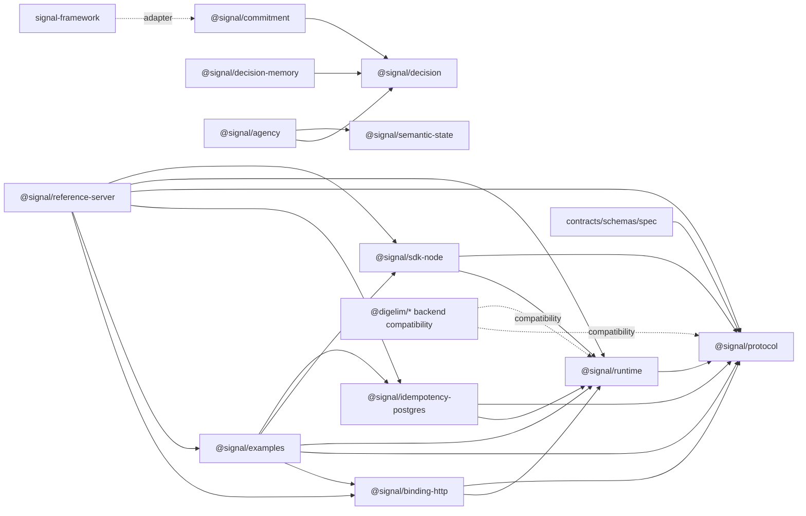

# Dependency Graph

Status: baseline graph from the Phase 0 audit.

## Package Graph

## External Dependencies

| Package | External Dependencies Of Architectural Interest |
| --- | --- |
| `@signal/protocol` | `zod` |
| `@signal/binding-http` | `fastify` |
| `@signal/idempotency-postgres` | `drizzle-orm`, `pg` |
| `@signal/examples` | `kafkajs`, `pg` |
| docs | Docusaurus toolchain |
| tests | Vitest and TypeScript toolchain |

## Desired Direction

- Public protocol definitions flow outward from `@signal/protocol`.
- Runtime behavior flows outward from `@signal/runtime`.
- Transports adapt to runtime behavior rather than redefining it.
- Persistence adapters implement runtime interfaces rather than owning protocol
  semantics.
- Compatibility packages either wrap canonical packages or clearly declare
  legacy behavior.

## Forbidden Direction

- Canonical packages must not import compatibility packages.
- Protocol contracts must not depend on application code.
- Runtime contracts must not depend on HTTP binding details.
- Durable store schemas must not be changed without migration compatibility
  tests.
- Examples must not become hidden dependencies of canonical packages.
