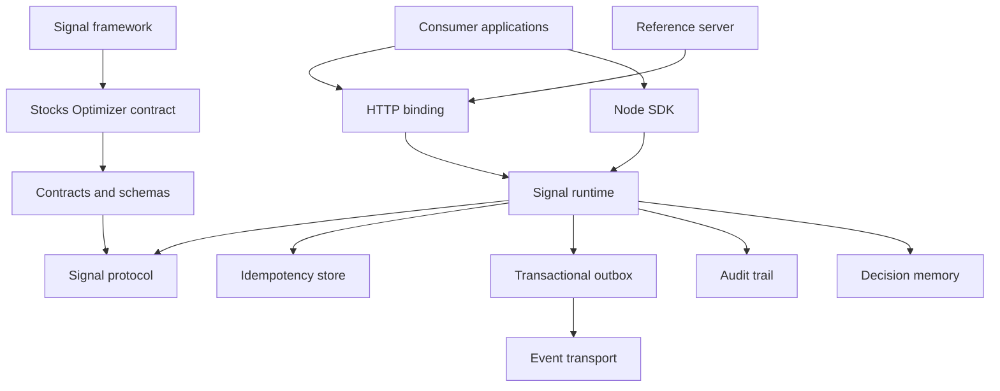
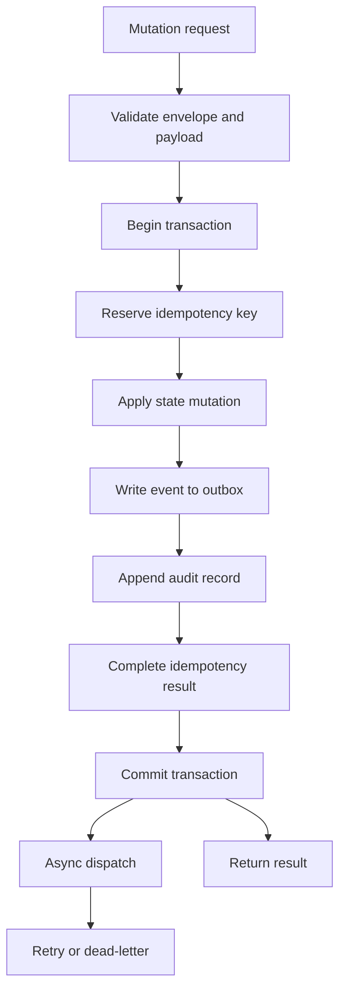
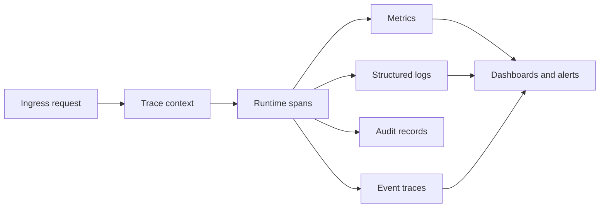
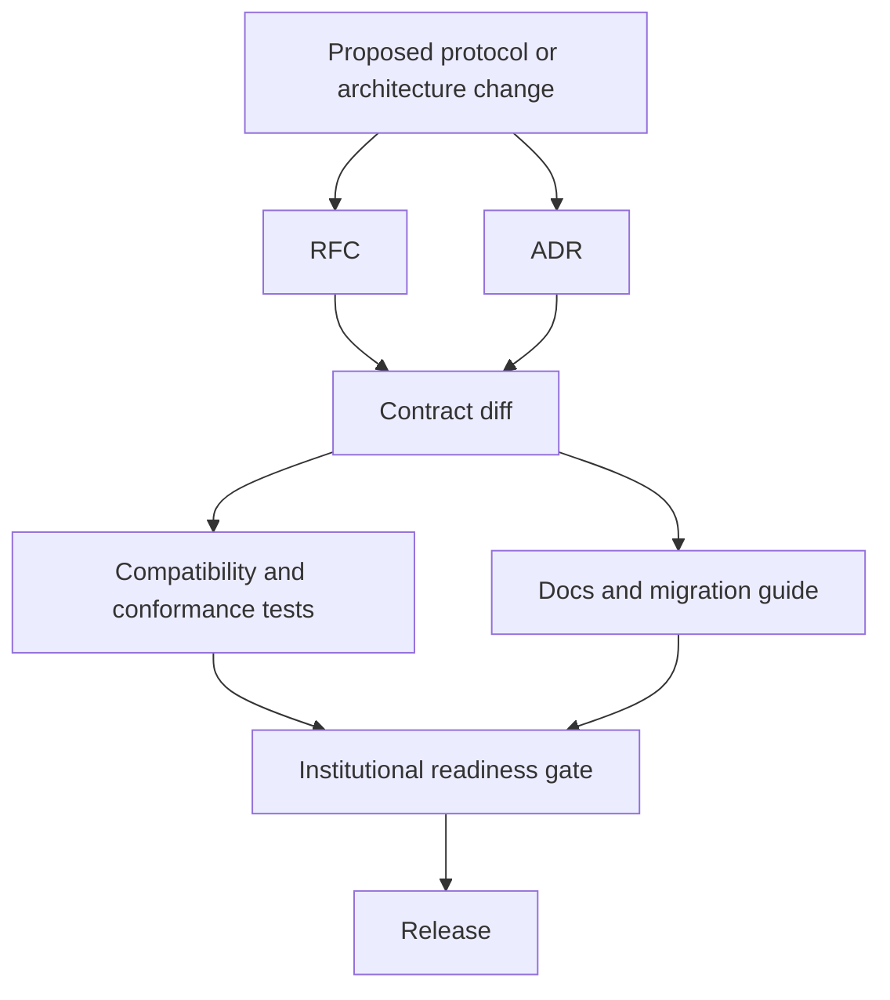
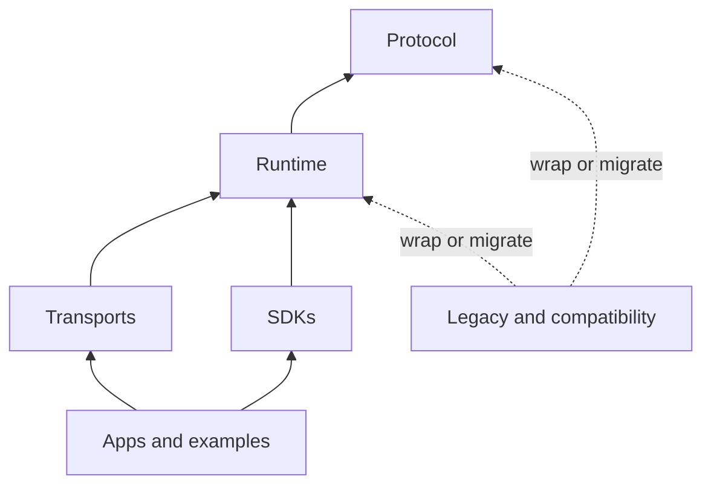

# Architecture Diagrams

These Mermaid diagrams are the baseline architecture diagrams for Phase 1.

## System Context

## Target Mutation Durability

## Observability Path

## Governance Path

## Module Boundary Direction

Canonical packages must point inward toward protocol and runtime. Legacy and
compatibility packages may wrap canonical packages, but canonical packages must
not depend on legacy packages.
