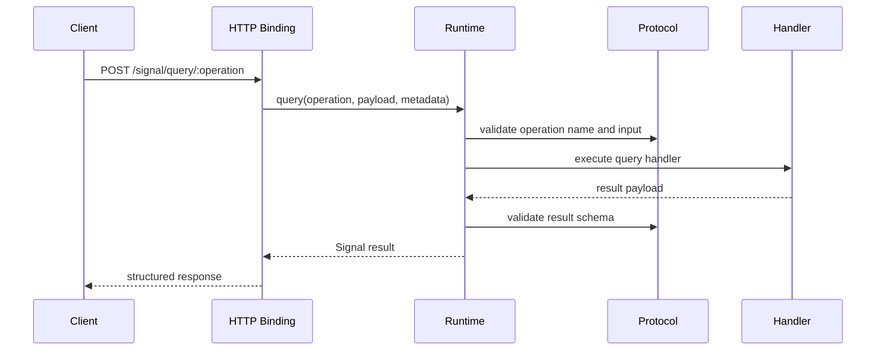
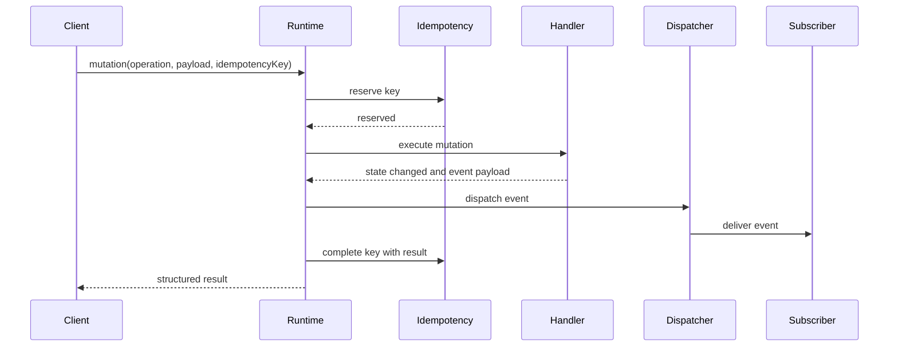
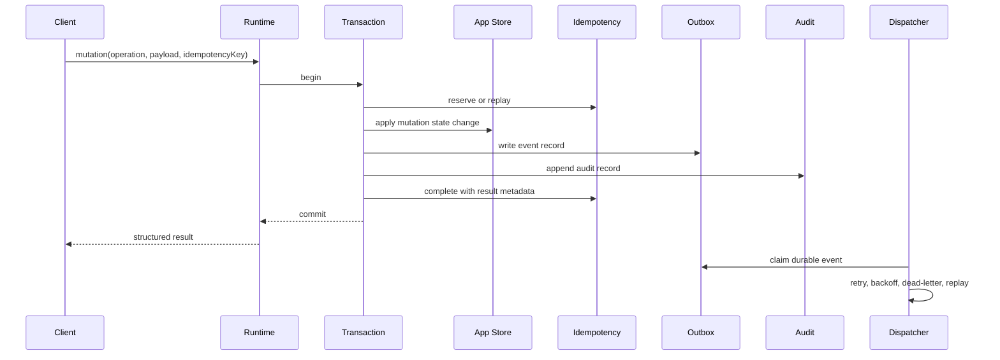
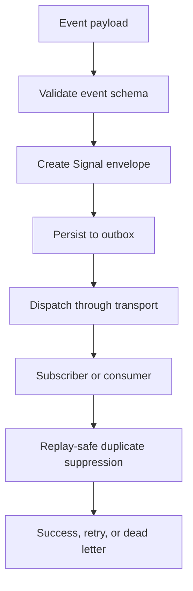
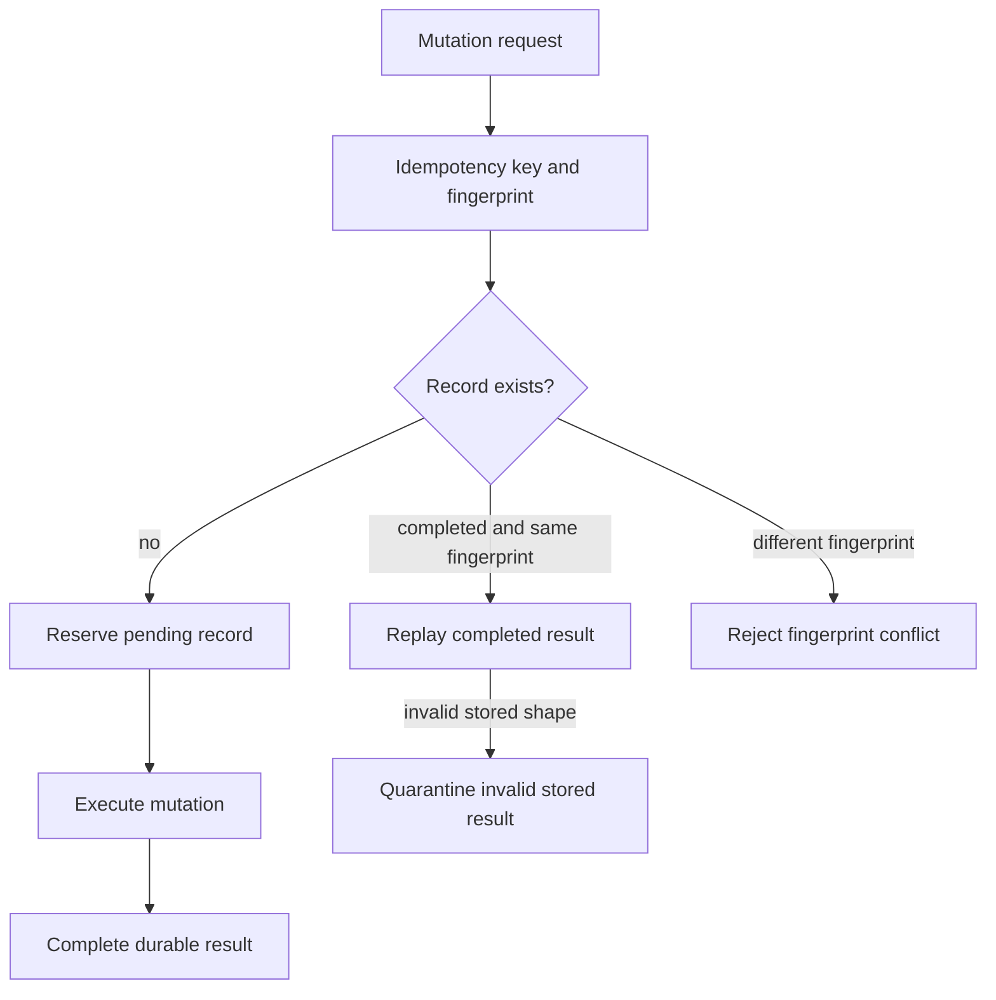
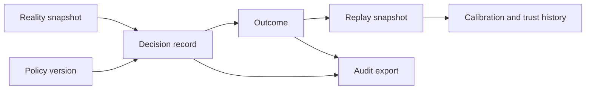
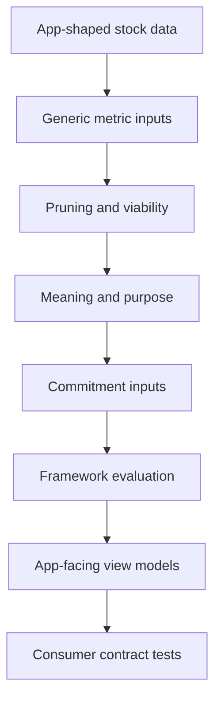

# Execution Flow

This document records the current execution model and the target
infrastructure-grade additions.

## Query Flow

Required additions:

- trace context extraction and propagation,
- auth and authorization hooks for protected queries,
- timeout and cancellation behavior,
- audit records for governed queries,
- stable metrics and logs.

## Mutation Flow: Current Risk

Risk: handler state, event delivery, and idempotency completion are not one
atomic durability unit.

## Mutation Flow: Infrastructure Target

Invariant: mutation state and durable event record commit together or neither
commits.

## Event Flow

Required additions:

- durable outbox,
- transport retry policy,
- dead-letter records,
- replay command/API,
- queue lag and depth metrics,
- idempotent consumers.

## Idempotency Flow

Required additions:

- schema validation before replay,
- expiration policy,
- tenant-aware uniqueness,
- transaction coupling with mutation and outbox,
- recovery for pending records after process crash.

## Decision Memory Flow

Required additions:

- policy/model/adapter versions on every governed decision,
- tenant/source isolation,
- pagination,
- archive and restore,
- reconstruction tests.

## Stocks Optimizer Adapter Flow

Required additions:

- tracked consumer contract,
- schemas and fixtures,
- provider verification in CI,
- explicit support status if full app contract remains outside the repository.
