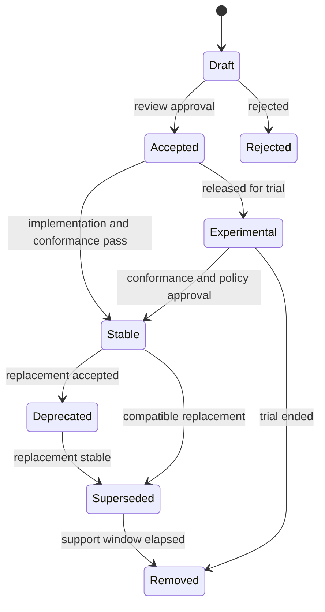

# Protocol Lifecycle

Signal protocol behavior must evolve through explicit lifecycle states. This
document defines the target lifecycle for RFCs, operations, contracts, and
schemas.

## Lifecycle States

| State | Meaning | Compatibility Promise |
| --- | --- | --- |
| Draft | Proposed behavior under review | Can change before acceptance. |
| Accepted | Approved behavior, not necessarily broadly released | Changes require RFC amendment. |
| Stable | Publicly supported behavior | Backward-compatible changes only. |
| Deprecated | Still supported but scheduled for replacement | Must include replacement and support window. |
| Superseded | Replaced by a newer accepted or stable behavior | Existing consumers keep support through policy window. |
| Removed | No longer part of supported public contract | Requires completed deprecation window and migration notes. |
| Legacy | Preserved for compatibility but excluded from new infrastructure claims | Must not be advertised as canonical behavior. |
| Experimental | Available for trials with explicit instability | Must not be required by stable consumers. |

## Protocol Change Flow



## Operation Versioning

Canonical operations use:

```txt
<domain>.<action>.vN
```

Rules:

- Backward-compatible field additions can stay within the same operation
  version when clients are not required to send or consume the new field.
- Breaking input, output, event, or error behavior requires a new operation
  version.
- Deprecated operations must declare replacement operation, deprecation date,
  support window, and removal eligibility.
- Capabilities must expose operation lifecycle state.

## Contract Artifact Flow

```mermaid
flowchart LR
  RFC[RFC]
  Source[Canonical protocol source]
  Contracts[/contracts]
  JSON[JSON Schema]
  OpenAPI[OpenAPI]
  AsyncAPI[AsyncAPI]
  Fixtures[Conformance fixtures]
  CI[Compatibility CI]

  RFC --> Source
  Source --> Contracts
  Contracts --> JSON
  Contracts --> OpenAPI
  Contracts --> AsyncAPI
  Contracts --> Fixtures
  JSON --> CI
  OpenAPI --> CI
  AsyncAPI --> CI
  Fixtures --> CI
```

## Required Metadata

Each public operation must eventually declare:

```yaml
operation: post.publish.v1
kind: mutation
status: stable
introduced: 1.0.0
deprecated: null
replacement: null
rfc: RFC-0001
contract_hash: sha256:...
auth:
  required: true
  scopes:
    - posts:write
idempotency:
  mode: required
  expiration: 24h
events:
  - post.published.v1
```

## Release Gate

A release that changes protocol behavior must include:

- RFC or RFC amendment,
- contract diff,
- generated schema diff,
- conformance fixture update,
- migration or compatibility note,
- changelog entry,
- release approval from Protocol and Governance owners.
