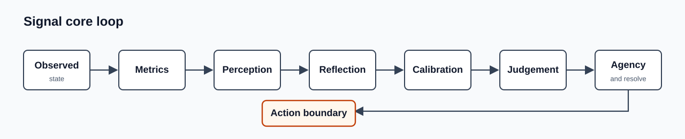
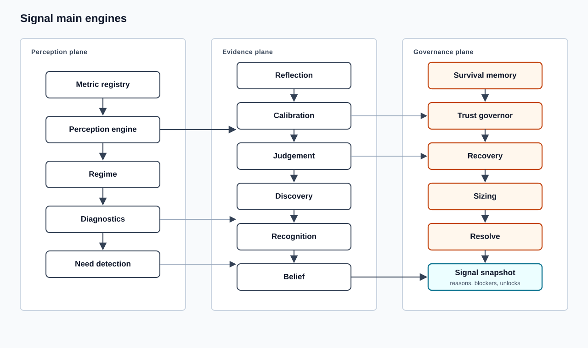
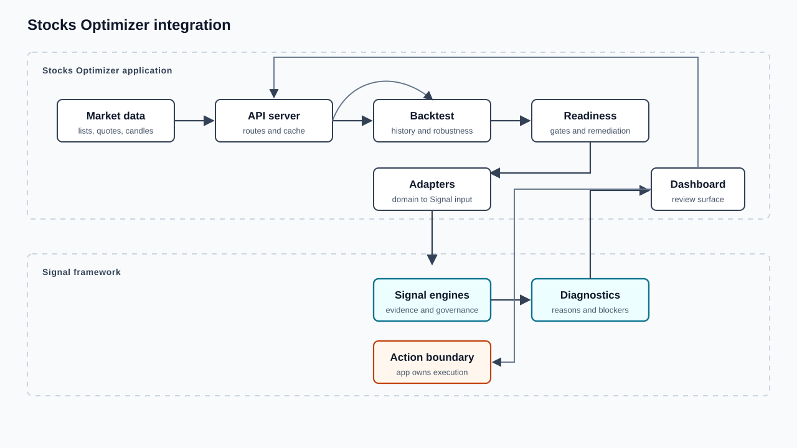

# Signal Framework Architecture

Signal turns observed state into governed action.

It is domain-neutral. Applications provide data, context, and execution surfaces. Signal provides perception, evidence checks, confidence control, decision governance, sizing, and audit outputs.

## Boundary

Signal owns:

- metric normalization and perception layers
- reflection, calibration, judgement, recognition, and discovery
- trust, survival memory, recovery, legacy, resolve, viability, and sizing
- auditable reasons, blockers, unlock conditions, and invalidation conditions

Applications own:

- market data, user data, persistence, and external APIs
- domain adapters that map app data into Signal inputs
- UI, alerts, order routing, and execution
- app-specific policy thresholds and operational workflow

## Core Loop

The action boundary is intentional. Signal may approve, limit, reject, or escalate an intent. It does not execute the real-world action.

## Main Engines

## Snapshot Shape

A Signal cycle produces a snapshot, not an order.

The snapshot can include:

- perception scores and dominant layers
- regime, synchronization, diagnostics, and needs
- reflection and calibration state
- discovery, recognition, judgement, and belief
- survival memory, trust, recovery, sizing, and resolve outputs
- legacy reputation, titles, achievements, badges, milestones, campaigns, unlocks, and prestige
- reasons, blockers, warnings, unlock conditions, and invalidation conditions

## Stocks Optimizer Integration

`stocks-optimizer` is a reference application using Signal. It is not the framework.

The app-specific adapters translate stock and crypto data into generic Signal inputs:

- `survival-memory-adapter.ts`
- `belief-adapter.ts`
- `stock-judgement.ts`
- `opportunity-discovery.ts`
- `stock-recognition.ts`
- `agency-diagnostics.ts`
- `resolve-adapter.ts`
- `financial-sizing.ts`

## Runtime Flow In Stocks Optimizer

1. The dashboard requests markets, instruments, quotes, strategy summaries, history, and trades.
2. The API server loads market data and historical bars.
3. The backtest layer builds trades, history, robustness diagnostics, and forward-shadow evidence.
4. Strategy readiness evaluates benchmark edge, drawdown, walk-forward stability, parameter stability, calibration, survival memory, trust, recovery, and remediation.
5. Signal adapters evaluate belief, judgement, discovery, recognition, agency, resolve, viability, and sizing.
6. The API returns diagnostics and candidate decisions.
7. The dashboard renders explanations, action lists, market perception, and risk gates.

## Design Rules

- Keep Signal engines pure and domain-neutral.
- Put provider logic and UI language in adapters or applications.
- Treat every confidence value as evidence-bound.
- Prefer explicit blockers over hidden penalties.
- Keep risk gates composable: survival, calibration, trust, recovery, resolve, and sizing should be independently inspectable.
- Keep Identity presentational: titles and permanent accomplishments should come from Legacy.
- Do not let recognition of a familiar state bypass survival or trust restoration.
- Do not execute from framework output without an application-owned action boundary.
